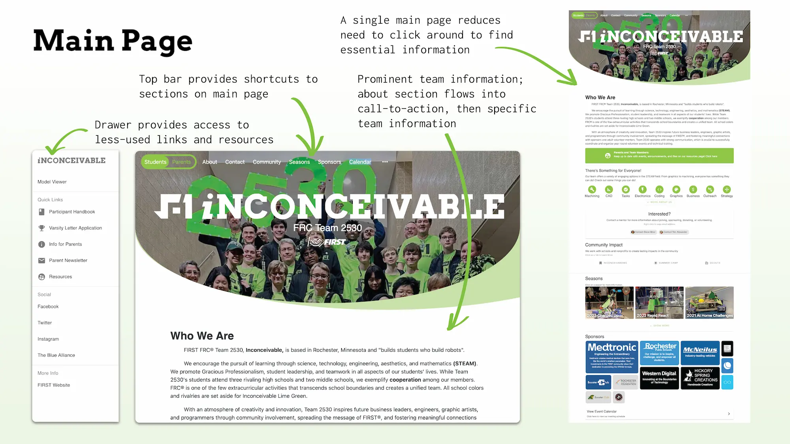

    <h2 class="project-overview__title" >Project Overview</h2>
    

        

            <h5 class="project-overview__metric-title">Challenge</h5>
            Rebuild the FRC Team 2530 to be more usable, readable, engaging, and maintainable by future team members.
        

        

            <h5 class="project-overview__metric-title">Skills Used</h5>
            

                
HTML

                
CSS

                
JavaScript

                
Illustrator

                
UI Design

                
UX Research

            

        

        

            

                <h5 class="project-overview__metric-title">Completed For</h5>
                FRC Team 2530
            

            

            <h5 class="project-overview__metric-title">Project Type</h5>
                Real-world Problem Solving
            

        

    

## Problem
When I started work on the team's website in 2018, it was cobbled together and neglected. I started by making small tweaks to the interface, but I eventually began prototyping a complete overhaul.

## Finished Page

