

    <h2 class="project-overview__title" >Project Overview</h2>
    

        

            <h5 class="project-overview__metric-title">Prompt</h5>
            Create a water bottle with an assigned material and cap type. (Glass with screw top)
        

        

            <h5 class="project-overview__metric-title">Timeline</h5>
            

            4
            weeks
            

        

        

            <h5 class="project-overview__metric-title">Skills Used</h5>
            

                
Trend Analysis

                
Ideation

                
Model Making

                
Prototyping

                
SOLIDWORKS

                
KeyShot

            

        

        

            

                <h5 class="project-overview__metric-title">Completed For</h5>
                University
            

            

            <h5 class="project-overview__metric-title">Project Type</h5>
                Freeform Skill Application
            

        

    

## Existing Market Inspiration

    

        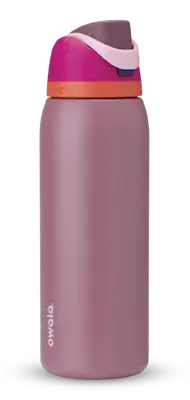
        <h3 style="font-weight:normal"><strong>Owala</strong> Freesip</h3>
        
Active & Fashionable

    

    

        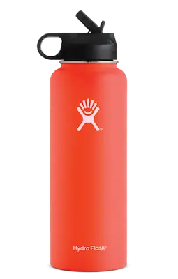
        <h3 style="font-weight:normal">Hydro Flask</h3>
        
Outdoorsy

    

    

        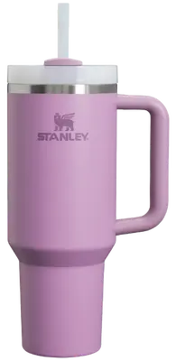
        <h3 style="font-weight:normal"><strong>Stanley</strong> Quencher</h3>
        
Relaxed & Sedentary

    

    

        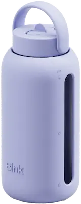
        <h3 style="font-weight:normal"><strong>Bink</strong> Day Bottle</h3>
        
Wellness Focused

    

    

        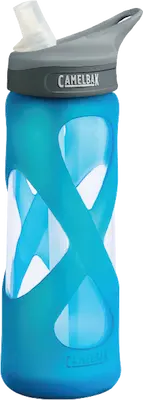
        <h3 style="font-weight:normal"><strong>Camelbak</strong> Eddy</h3>
        
Outdoorsy But Glass

    

    

        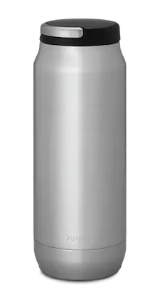
        <h3 style="font-weight:normal">Purist</h3>
        
Glass-like Inner Coating

    

    

        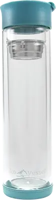
        <h3 style="font-weight:normal"><strong>EcoVessel</strong> Vue</h3>
        
Insulated Glass

    

    

        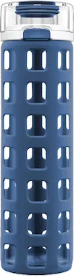
        <h3 style="font-weight:normal"><strong>Ello</strong> Syndicate</h3>
        
Ornate & Sedentary

    

## Persona Archetypes & Values

    

        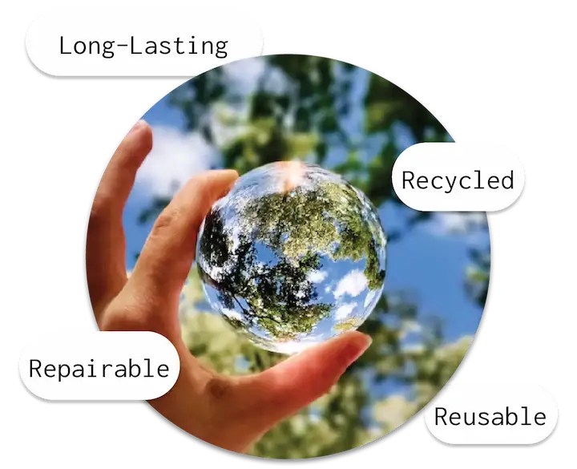
        <h3>Planet Conscious</h3>
        
People often use reusable water bottles to stay hydrated on the go without single-use plastic. They should feel good about their purchase.

    

    

        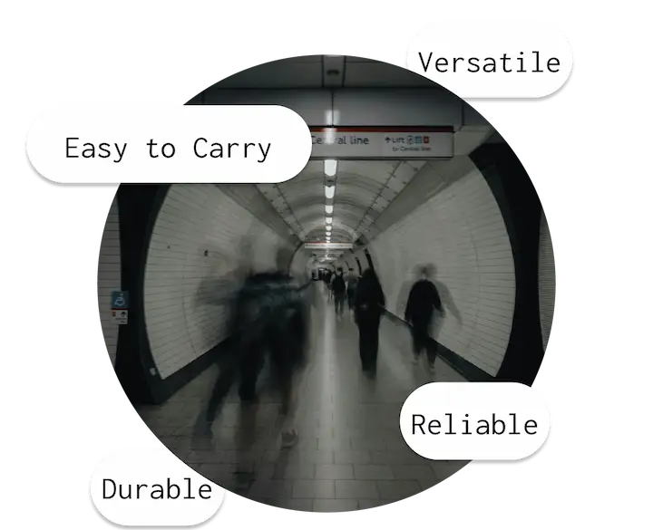
        <h3>On The Move</h3>
        
Water bottles should be durable and adaptable to accomodate everyday traveling and commuting.

    

    

        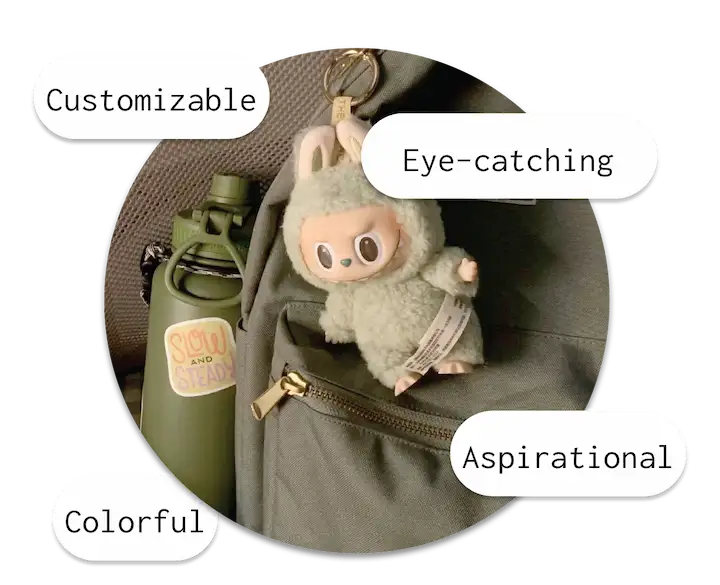
        <h3>Trendy</h3>
        
As an everyday accessory, some people are looking for bottles that match their personality and aspirations. 

    

## Aesthetic Direction
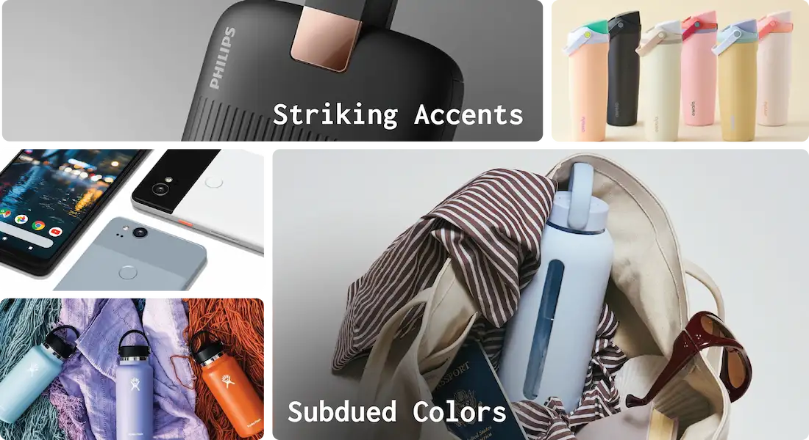

## Ideation
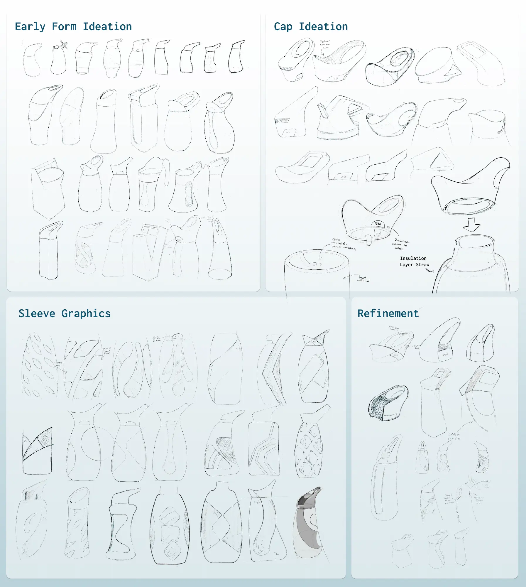

## Form & Colorway Iteration Renders
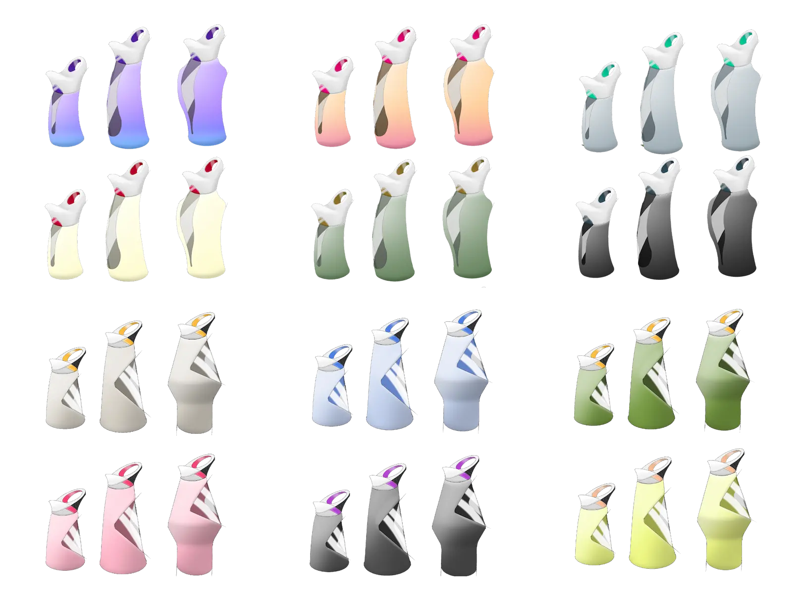

## Modeling Process

    

        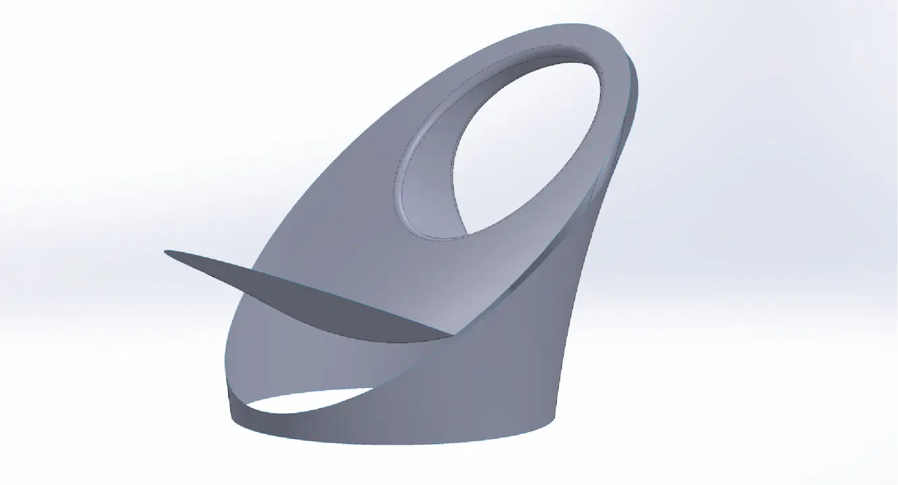
        

            <h3>CAD Process</h3>
            Basic Surfaces 
        

    

    

        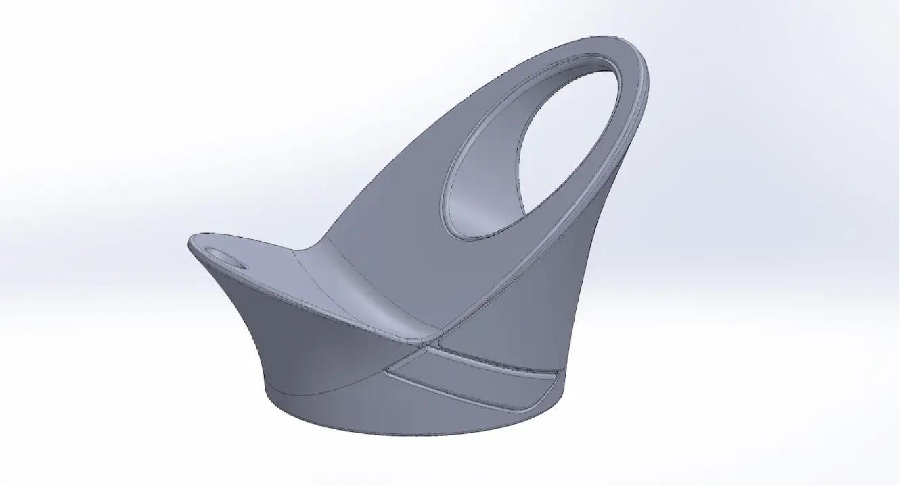
        

            <h3>CAD Process</h3>
            Solidified Cap
        

    

    

        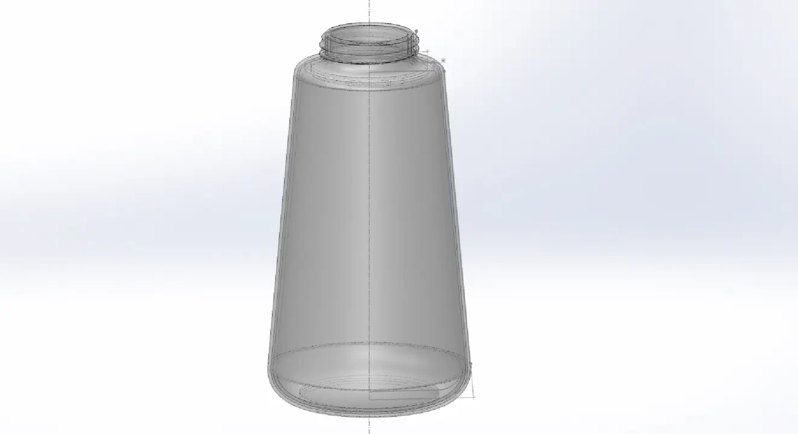
        

            <h3>CAD Process</h3>
            Glass Bottle
        

    

    

        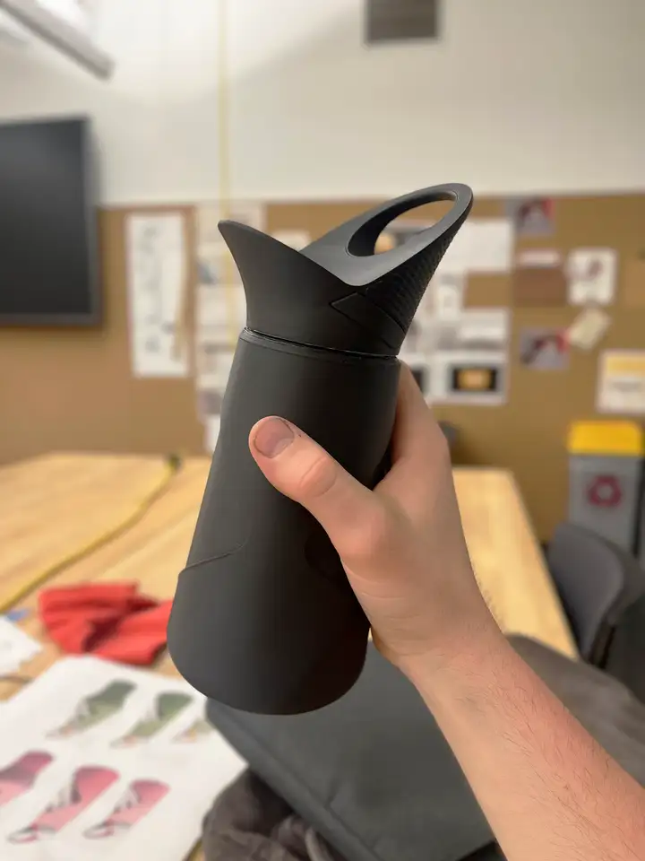
        

            <h3>Printed Prototype</h3>
        

    

    

        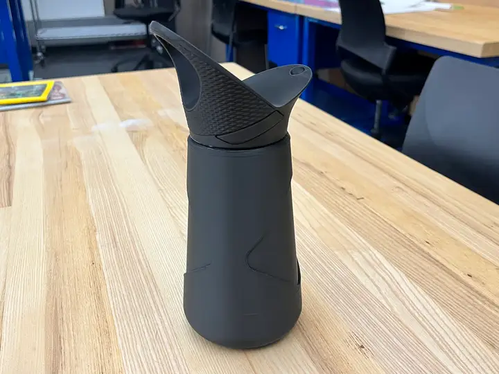
        

            <h3>Printed Prototype</h3>
        

    

## Final Renders
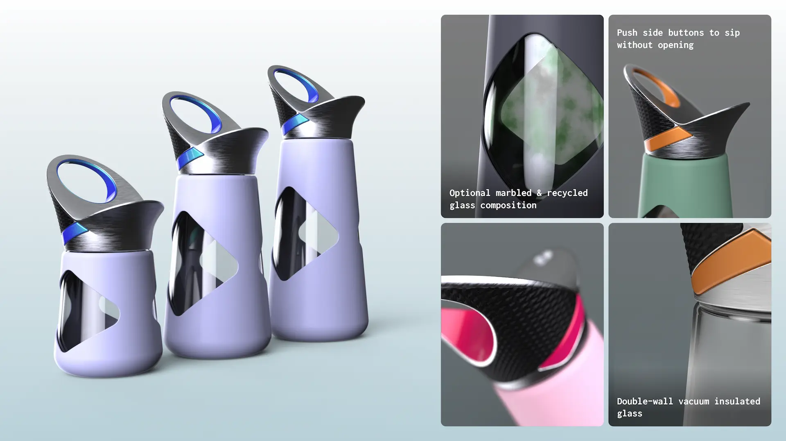

## Colorways

    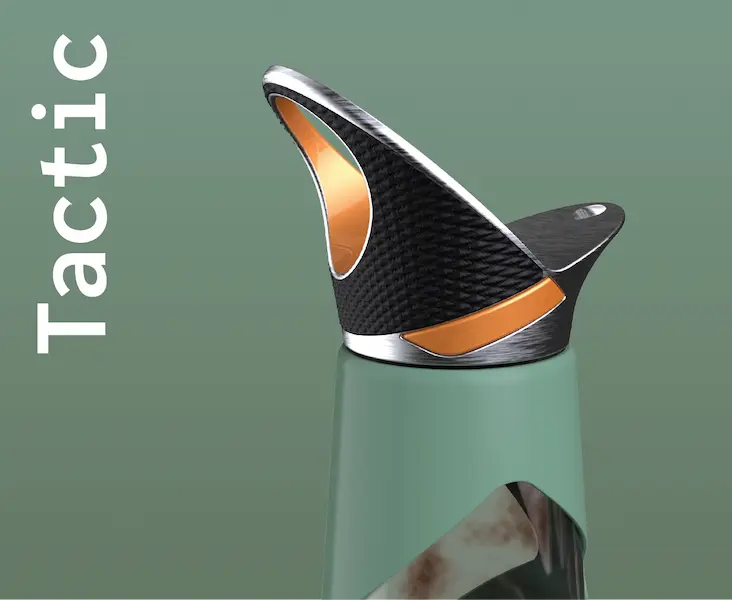
    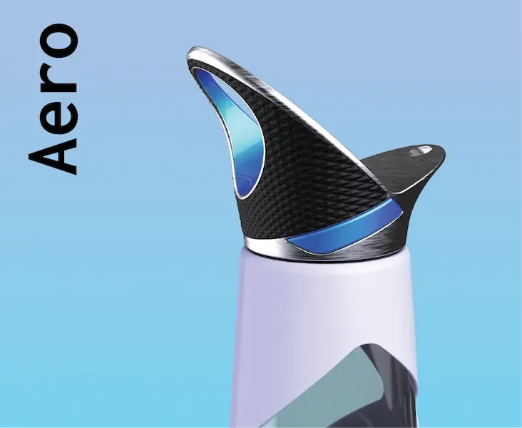
    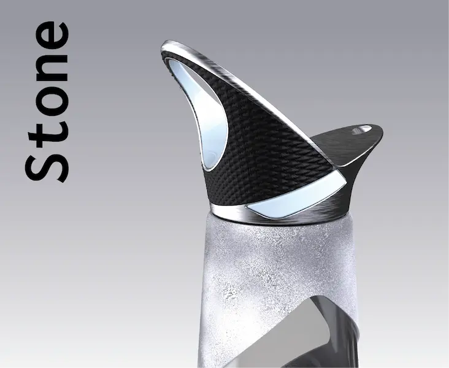
    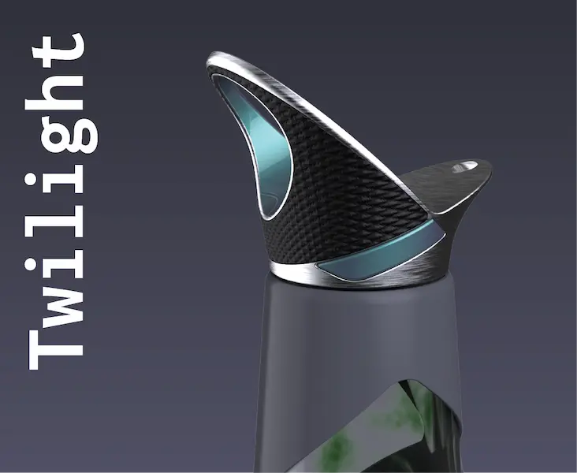
    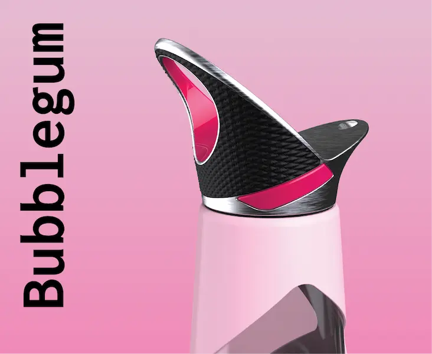
    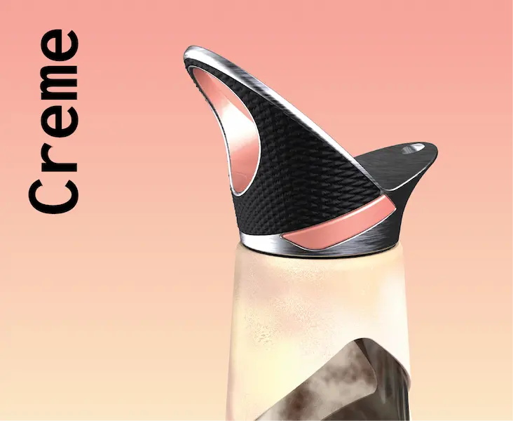

