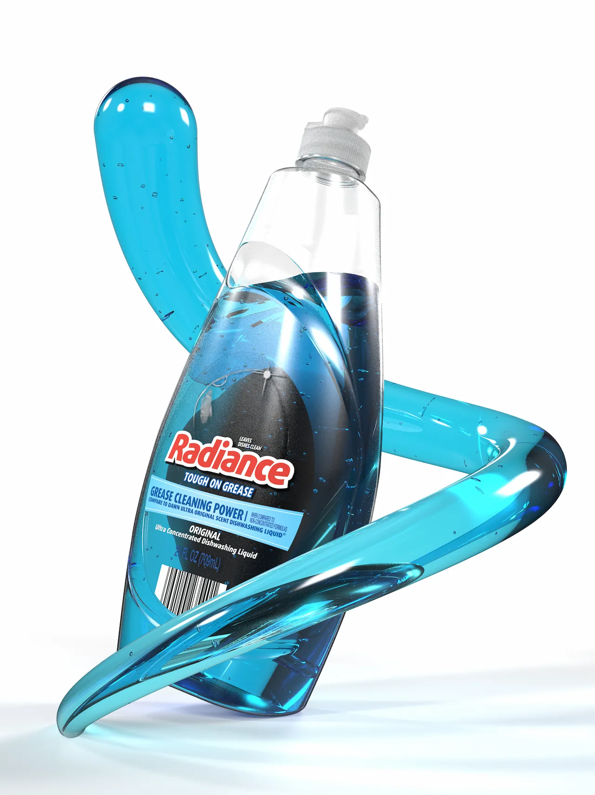
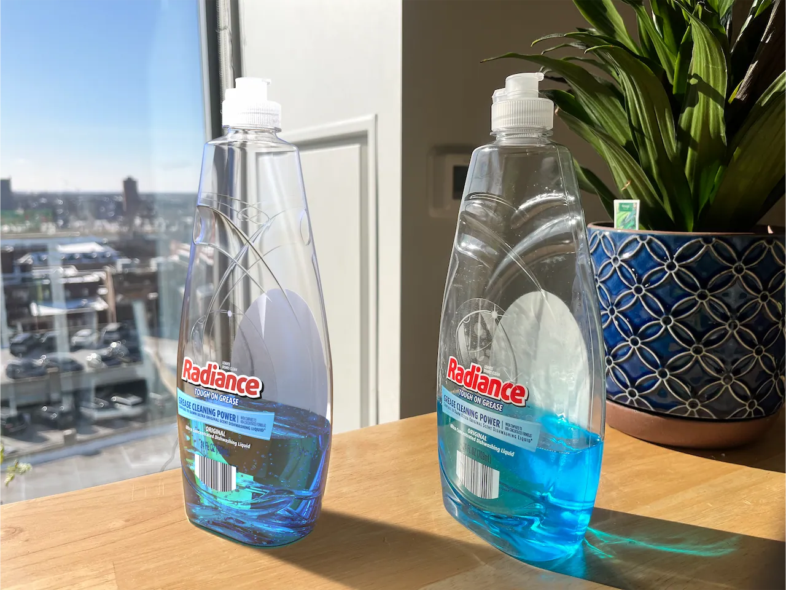

# Radiance Dish Soap Bottle - Completed Spring 2025

### Project Requirements
* Replicate a bottle using surface modeling in Solidworks
* Render in Keyshot to show comparison with the original bottle

### Result

# Poplite Classic - Completed Fall 2024

### Project Requirements
* Design and model a air-pop popcorn machine in SolidWorks
* Render the appliance using KeyShot

### Design Intent
* Inspired by the bright colors and metallic accents found in 1950s appliances
* Draws from Preto's existing Poplite lineup and styling

### Result

