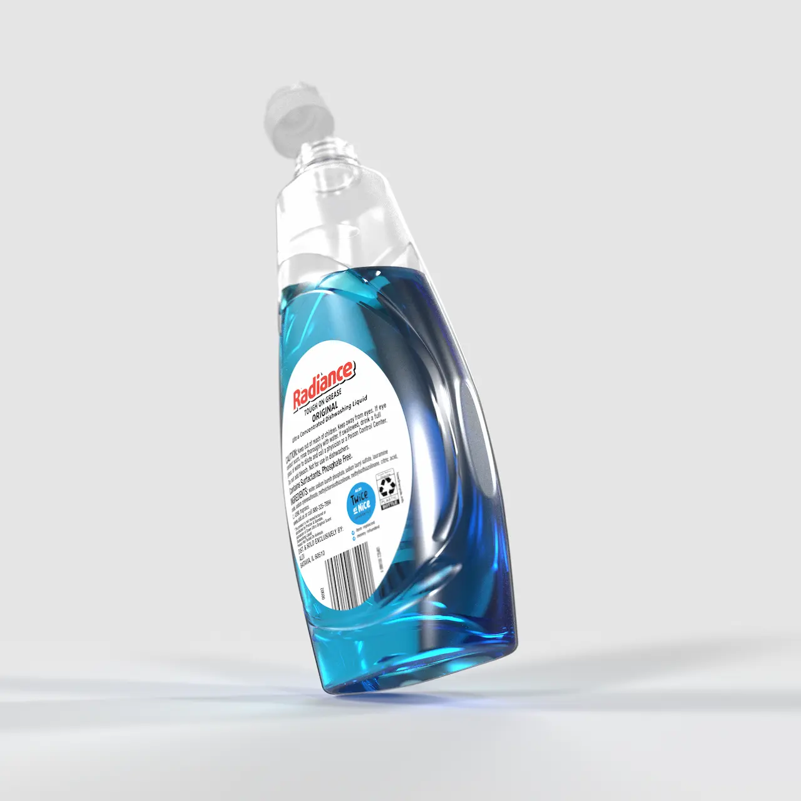

# Radiance Dish Soap Bottle

    <h2 class="project-overview__title" >Project Overview</h2>
    

        

            <h5 class="project-overview__metric-title">Project Requirements</h5>
            Replicate a bottle in SOLIDWORKS using surfaces, then render in KeyShot
        

        

            <h5 class="project-overview__metric-title">Timeline</h5>
            

            4
            weeks
            

        

        

            <h5 class="project-overview__metric-title">Skills Used</h5>
            

                
SOLIDWORKS

                
Surfacing

                
KeyShot

                
Java

                
Adobe Suite

            

        

        

            

                <h5 class="project-overview__metric-title">Completed For</h5>
                University
            

            

            <h5 class="project-overview__metric-title">Project Type</h5>
                New Skill Building
            

            

            <h5 class="project-overview__metric-title">Semester</h5>
                Spring 2025
            

        

    

### Labels
To render, I needed realistic labels. Aldi doesn't provide high-quality transparent labels of this product, so I replicated them with some help from Illustrator, Photoshop, and a custom Java program.

# Poplite Classic

    <h2 class="project-overview__title" >Project Overview</h2>
    

        

            <h5 class="project-overview__metric-title">Project Requirements</h5>
            Build an original countertop appliance in SOLIDWORKS.
        

        

            <h5 class="project-overview__metric-title">Timeline</h5>
            

            3
            weeks
            

        

        

            <h5 class="project-overview__metric-title">Skills Used</h5>
            

                
SOLIDWORKS

                
KeyShot

            

        

        

            

                <h5 class="project-overview__metric-title">Completed For</h5>
                University
            

            

            <h5 class="project-overview__metric-title">Project Type</h5>
                Skill Building
            

            

            <h5 class="project-overview__metric-title">Semester</h5>
                Fall 2024
            

        

    

### Aesthetic Intent
* Inspired by the bright colors and metallic accents found in 1950s appliances
* Draws from Preto's existing Poplite lineup and styling

