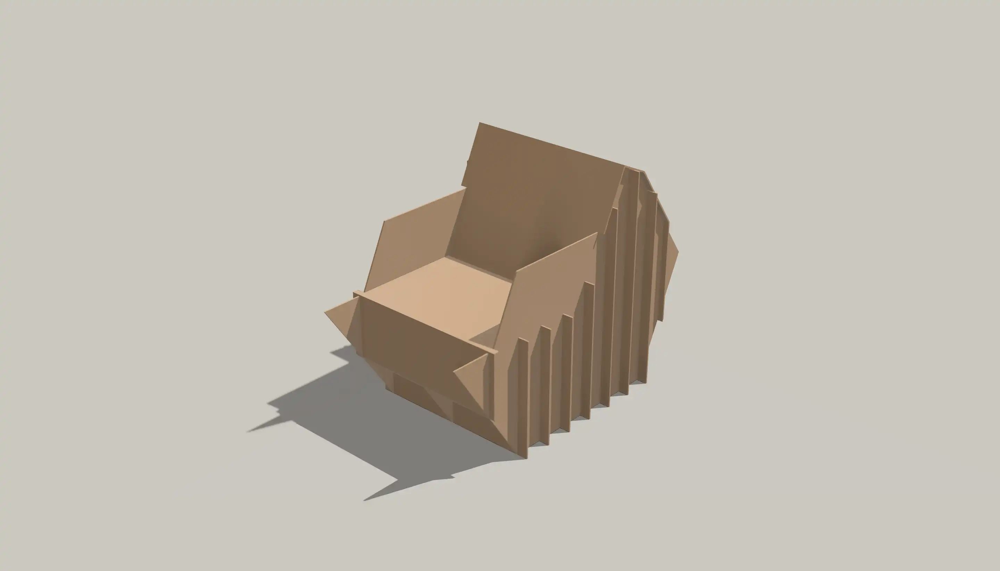
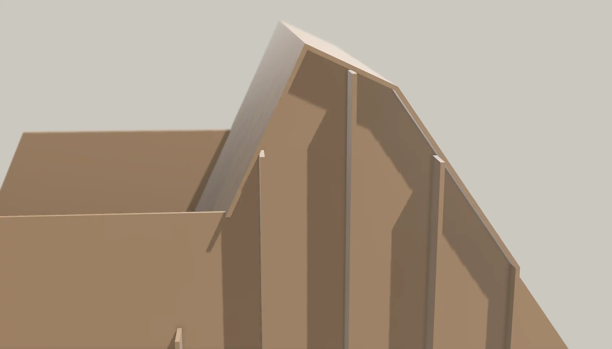
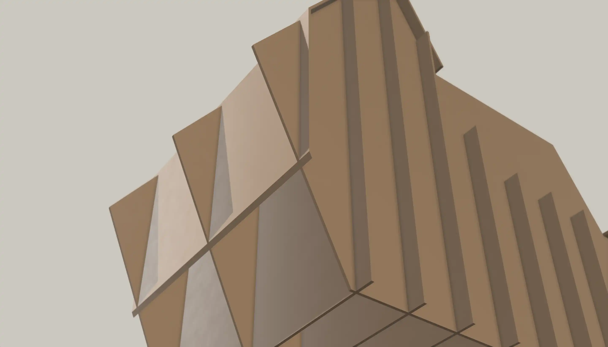
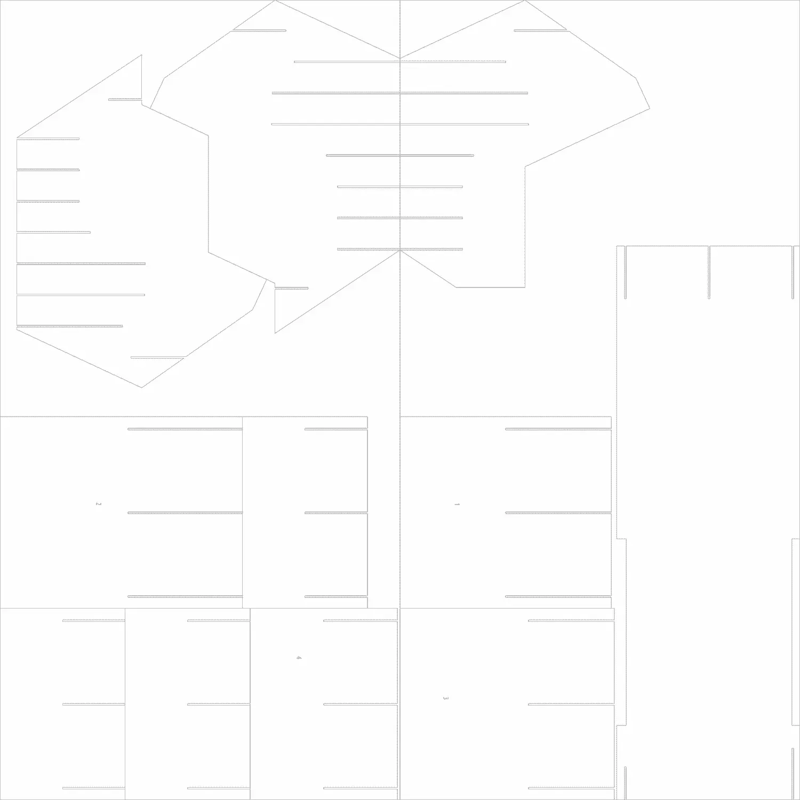

## Project Requirements
* **Functional**: Supports body weight for the two hour critique
* **Comfortable**: Seat pan is at most two inches from knee joint, supports back and butt (not a stool).
* **Simple**: A single object made from two 4'x8' cardboard panels.
* **Interesting**: The chair must be visually interesting.

## Ideation

## Initial 1/6 Scale Models

## CAD Model & Cut Layout

    
    
    
    
    

## Final Model

    
    
    
    

