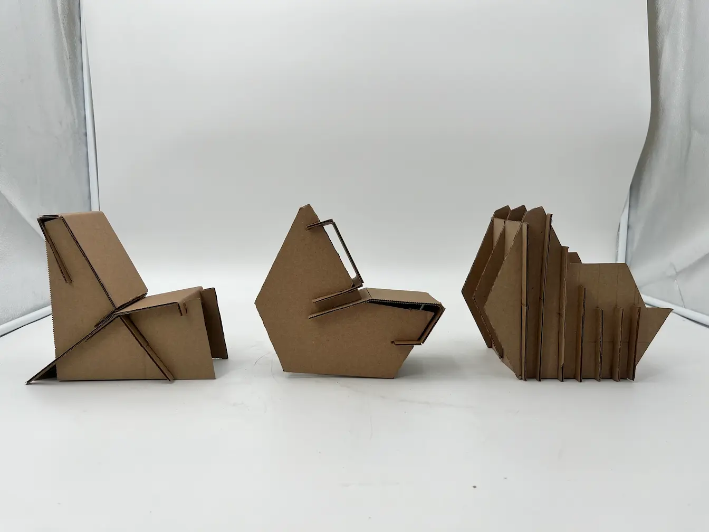

    <h2 class="project-overview__title" >Project Overview</h2>
    

        

            <h5 class="project-overview__metric-title">Prompt</h5>
            Create a visually interesting cardboard chair for extended use and easy hand cutting/assembly.
        

        

            

                <h5 class="project-overview__metric-title">Timeline</h5>
                

                3
                weeks
                

            

        

        

            <h5 class="project-overview__metric-title">Skills Used</h5>
            

                
Ideation

                
Model Making

                
Prototyping

                
SOLIDWORKS

            

        

        

            

                <h5 class="project-overview__metric-title">Completed For</h5>
                University
            

            

            <h5 class="project-overview__metric-title">Project Type</h5>
                Freeform Skill Application
            

        

    

## Project Requirements
* **Functional**: Supports body weight for the two hour critique
* **Comfortable**: Seat pan is at most two inches from knee joint, supports back and butt (not a stool).
* **Simple**: A single object made from two 4'x8' cardboard panels.
* **Interesting**: The chair must be visually interesting.

## Ideation

## Initial 1/6 Scale Models

## CAD Model & Cut Layout

    
    
    
    
    

## Final Model

    
    
    
    

