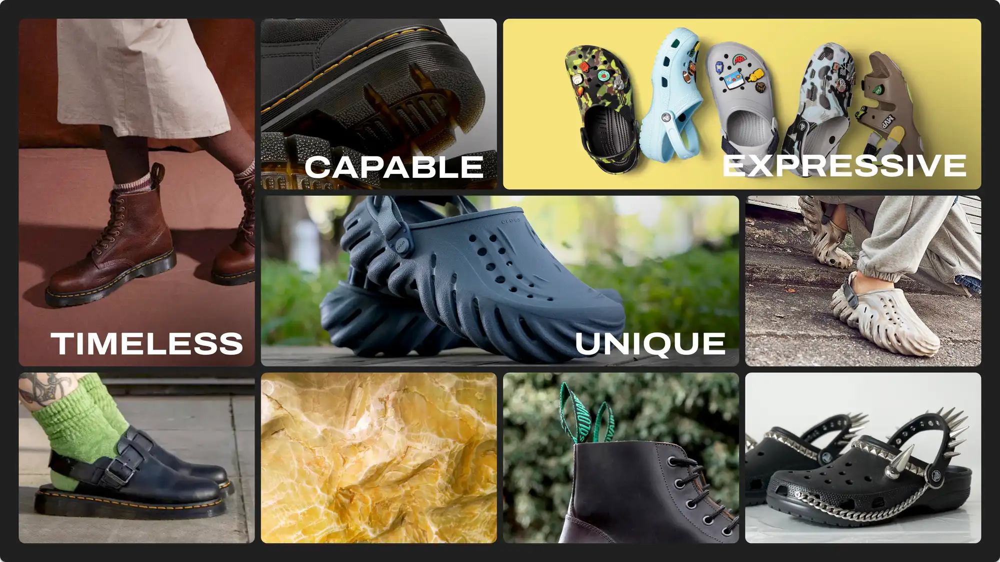
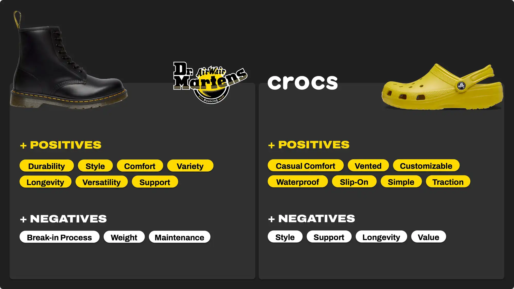
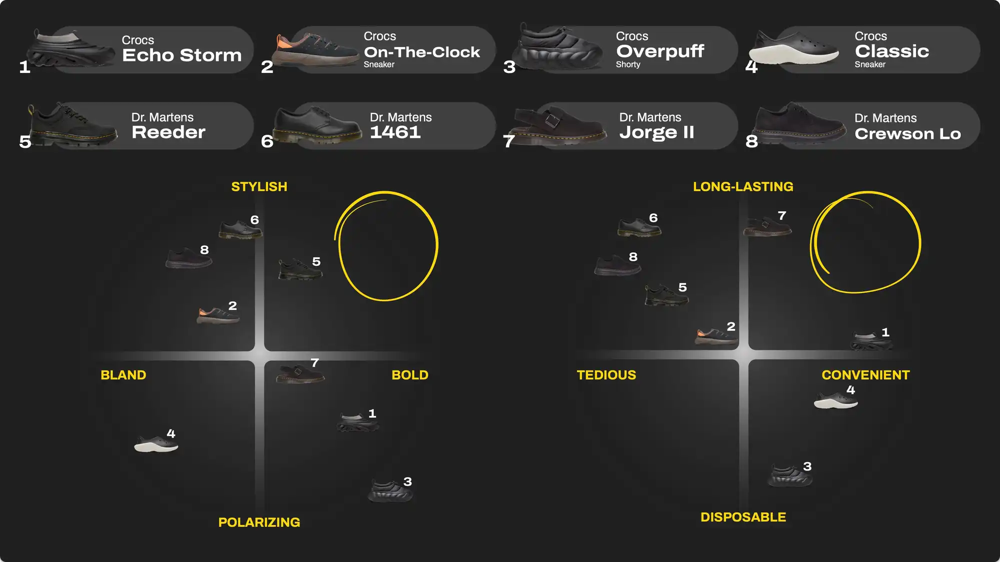
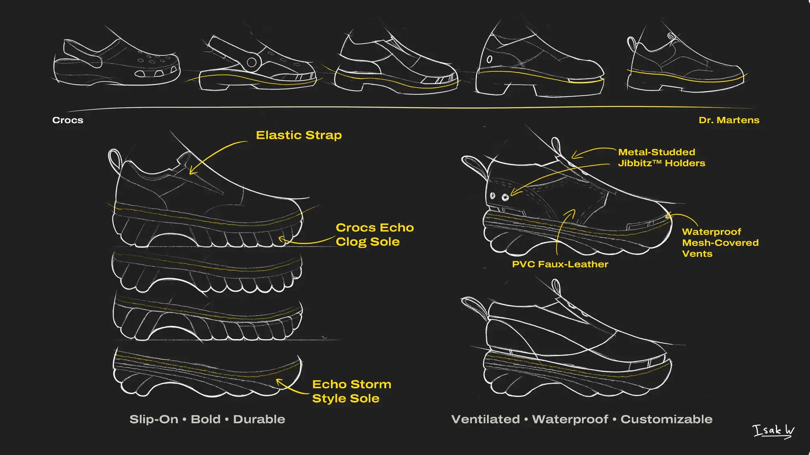
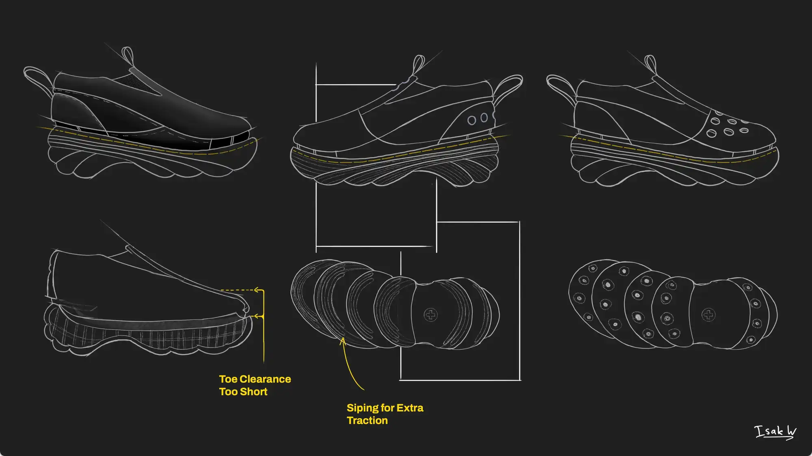
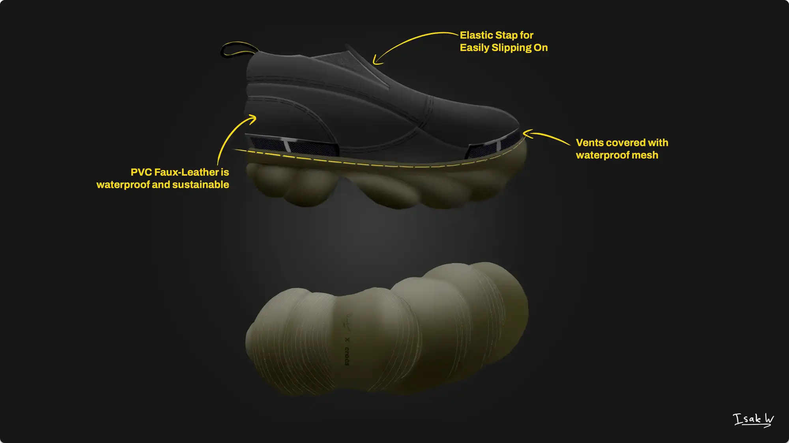
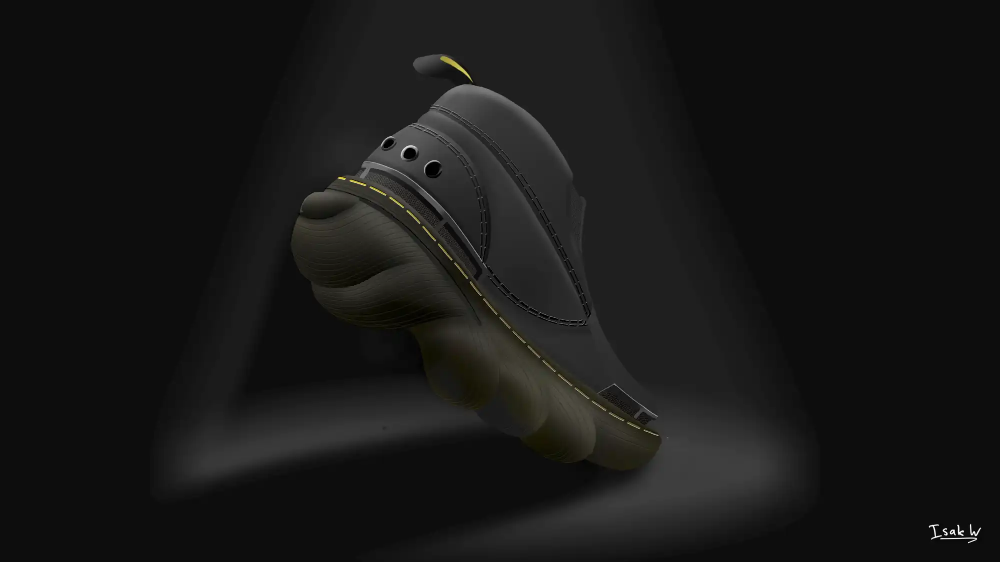

    <h2 class="project-overview__title" >Project Overview</h2>
    

        

            <h5 class="project-overview__metric-title">Prompt</h5>
            Research, ideate, and render an original shoe in Photoshop.
        

        

            

                <h5 class="project-overview__metric-title">Timeline</h5>
                

                4
                weeks
                

            

        

        

            <h5 class="project-overview__metric-title">Skills Used</h5>
            

                
Ideation

                
Digital Rendering

                
Photoshop

                
InDesign

            

        

        

            

                <h5 class="project-overview__metric-title">Completed For</h5>
                University
            

            

            <h5 class="project-overview__metric-title">Project Type</h5>
                Skill Building
            

        

    

## Mood Board

## Market Research

## Ideation

## Renders

