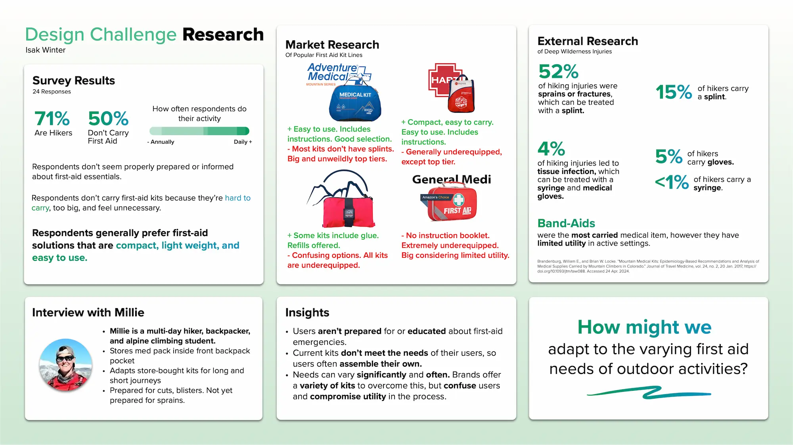
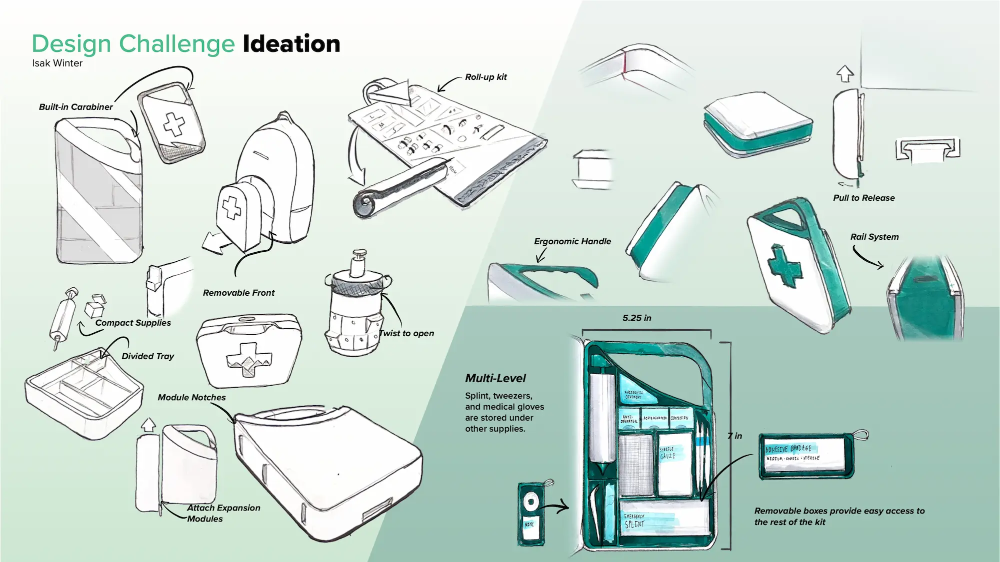
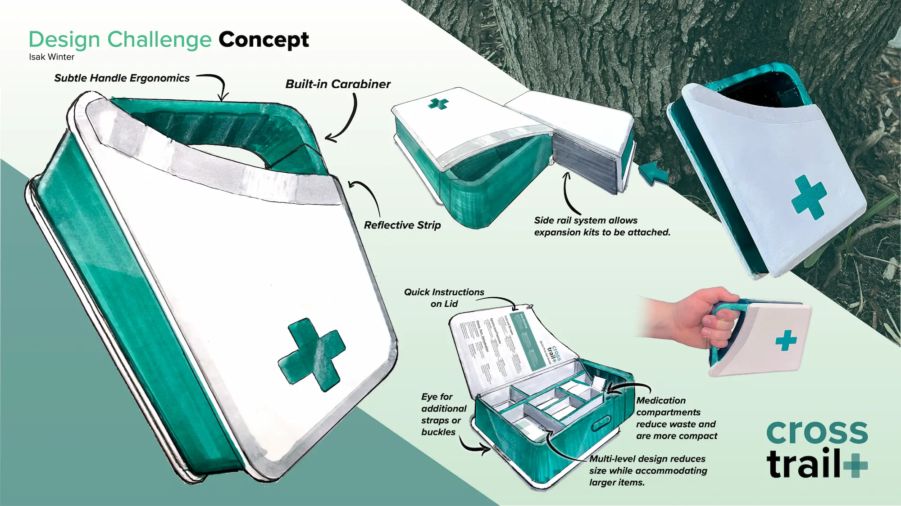

    <h2 class="project-overview__title" >Project Overview</h2>
    

        

            <h5 class="project-overview__metric-title">Prompt</h5>
                Create an innovative first aid kit for industrial workers, outdoors-people, or primary school staff.
        

        

            <h5 class="project-overview__metric-title">Timeline</h5>
            

            2
            weeks
            

        

        

            <h5 class="project-overview__metric-title">Skills Used</h5>
            

                
Research

                
Ideation

                
Model Making

                
Analog Rendering

            

        

        

            

                <h5 class="project-overview__metric-title">Completed For</h5>
                University
            

            

            <h5 class="project-overview__metric-title">Project Type</h5>
                Freeform Skill Application
            

        

    

## About Portfolio Review
At the University of Minnesota, product design students must pass a portfolio review to progress past first-year courses. This includes a design challenge with a prompt. Students must research, ideate, sketch, render (in marker), and model a product in about two weeks based on the prompt.

<small>My entire slideshow is available [here.](assets/cross-trail/2024-portolio-review-submission.pdf)</small>