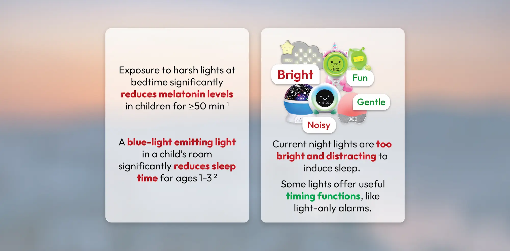
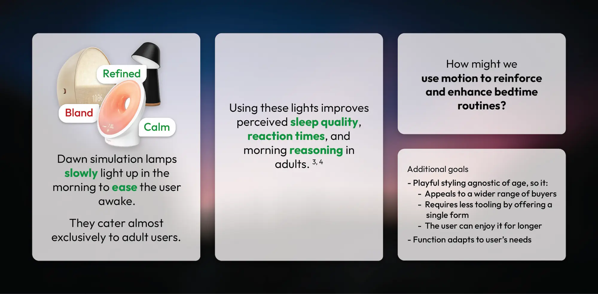
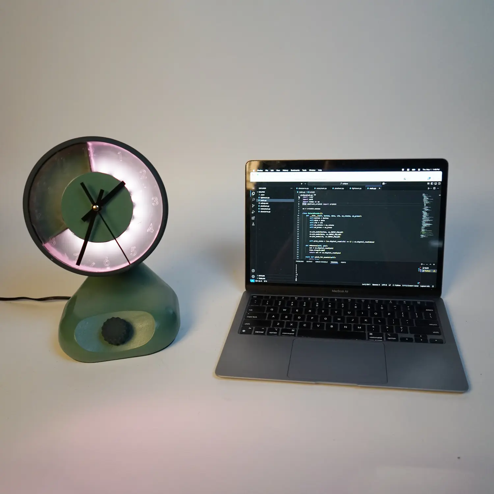
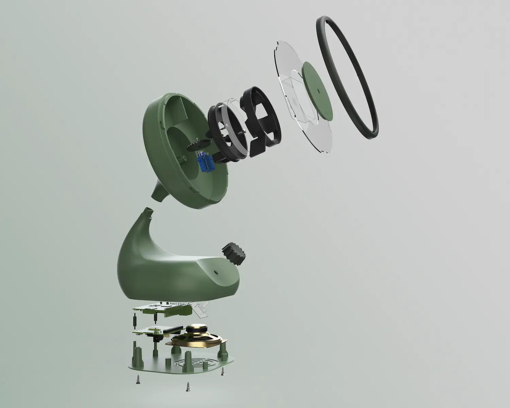

    <h2 class="project-overview__title" >Project Overview</h2>
    

        

            <h5 class="project-overview__metric-title">Prompt</h5>
            Use transformative motion in a lighting device or lamp.
        

        

            <h5 class="project-overview__metric-title">Timeline</h5>
            

            7
            weeks
            

        

        

            <h5 class="project-overview__metric-title">Skills Used</h5>
            

                
Research

                
Ideation

                
Model Making

                
Prototyping

                
SOLIDWORKS

                
Python

                
KeyShot

            

        

        

            

                <h5 class="project-overview__metric-title">Completed For</h5>
                University
            

            

            <h5 class="project-overview__metric-title">Project Type</h5>
                Freeform Skill Application
            

        

    

# Research
I explored bedtime lighting for both adults and children, then identified opportunities to improve and adapt them to fit the requirements of this project.

    
     

# Inspiration
Eclipse took early inspiration from several lighting devices functions, mechanisms, and expressive motifs.

# Ideation

# Early Form & Mechanism Models
These models tested the bellow mechanism and the explored forms that the light could take.

    
    
    
    
    
    

# Early SOLIDWORKS Models
Based on ideation and early models, I started prototyping iteratively with CAD and 3D printed parts. These models revealed problems that needed to be addressed, like skipping gear teeth.

    

        
        

            <h3>Model 1</h3>
            Form & mechanism development 
        

    

    

        
        

            <h3>Model 1</h3>
            Mechanism tolerance view
        

    

    

        
        

            <h3>Model 2</h3>
            Mechanism and assembly improvements & rotary knob
        

    

    

        
        

            <h3>Model 2</h3>
            View of servo and larger gear teeth
        

    

# Result

    
    
    
    
    
    

The bellows were excluded from the final model last-minute. The hub of the mechanism was larger than what the early prototypes tested. This unexpectedly caused the bellows to strain and pull over the hub when opened, and crumple when closed.

# A Look Inside

    <video autoplay muted loop playsinline style="pointer-events:none" aria-desc="Internal View Animation">
        <source src="assets/eclipse/anim.webm" type="video/webm">
        <source src="assets/eclipse/anim.mp4" type="video/mp4">
    </video>

The Eclipse model is based on Raspberry Pi, using a rotary endoder for input, a servo for hand movement, a programmable light strip, and a speaker. The clock mechanism is an off-the-shelf component.