

    <h2 class="project-overview__title" >Project Overview</h2>
    

        

            <h5 class="project-overview__metric-title">Requirements</h5>
            Conduct a heuristic evaluation of a local agency's website, then plan, coordinate, and report on a usability test session.
        

        

            <h5 class="project-overview__metric-title">Timeline</h5>
            

            1
            Semester
            

        

        

            <h5 class="project-overview__metric-title">Skills Used</h5>
            

                
Heuristic Evaluation

                
Usability Testing

                
UX Recommendations

                
Figma

            

        

        

            

                <h5 class="project-overview__metric-title">Completed For</h5>
                HOURCAR (Community Engaged Learning)
            

            

            <h5 class="project-overview__metric-title">Project Type</h5>
                Freeform Skill Application
            

        

    

## About This Project

    

        
        

            <h3>Group Collaborative Project</h3>
            Our team had three members. For their privacy, their names are redacted here.  
            This page pares down our 97 report pages and a presentation to HOURCAR.
        

    

    

        

            <h3>Community Engaged Learning</h3>
            This project is a part of the University of Minnesota's <a href="https://ccel.umn.edu/communitypartners" target="_blank" class="exlink" rel="noopener noreferrer">Community Engaged Learning</a> initiative, so our class collaborated with local organizations as student volunteers.
        

    

    

        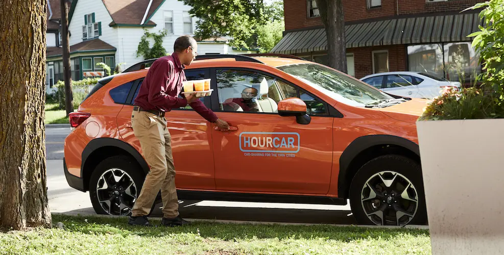
        

            <h3>What is HOURCAR?</h3>
            
Our team was assigned to work with <a href="//hourcar.org/mission" class="exlink" target="_blank" rel="noopener noreferrer">HOURCAR</a>, the Twin Cities' local nonprofit carshare service. They offer two services, the namesake <i>HOURCAR</i> and <i>Evie.</i> At the time, theses were separate websites.

            
HOURCAR is round-trip, so trips start and end at the same location.

            
Evie is one-way, so trips can start and end anywhere in the inner metro, similar to Lime scooters.

            
At the time, these services had separate homepages and a single support "wiki".

        

    

## HOURCAR's Goals
HOURCAR laid out three main areas they encouraged us to explore:

    

        
        

            <h3>First Impressions</h3>
            
Can new users define, differentiate, and choose a service based on their needs?

        

    

    

        
        

            <h3>Support Wiki</h3>
            
Is the new Wiki helpful and accessible? How might we improve the search function?

        

    

    

        
        

            <h3>Existing Members</h3>
            
How might we make the website more appealing and useful for existing members?

        

    

## Heuristic Evaluation
Heuristic evaluations don't catch everything, but they can help predict issues real users may encounter. To guide our usability test, we evaluated HOURCAR's websites based on <a href="//www.nngroup.com/articles/ten-usability-heuristics/" class="exlink" target="_blank" rel="noopener noreferrer">Nielsen's UI Heuristics:</a>

    

        

            <h3>👀 Visibility of System Status</h3>
            
What a system is doing should be conveyed to its users. If you press a button, you should know it worked.

        

    

    

        

            <h3>🎛️ Match Between System and Real World</h3>
            
Systems should speak their user's language, not technical jargon. This could include using visual metaphors and control mapping.

        

    

    

        

            <h3>💨 User Control and Freedom</h3>
            
Users need to be able to easily leave a page or undesirable state.

        

    

    

        

            <h3>🐣 Consistency and Standards</h3>
            
A product should be consistent with its users's expectations. It should consider expectations set by both other products and itself.

        

    

    

        

            <h3>🚧 Error Prevention</h3>
            
Use constraints, hints, and suggestions to prevent users from making an error in the first place.

        

    

    

        

            <h3>🚏 Recognition Over Recall</h3>
            
When users need to remember something, use cues and suggestions to help them recognize it instead.

        

    

    

        

            <h3>⏩ Flexibility and Efficiency of Use</h3>
            
Systems should be adaptable to both new and familiar users; as people learn the system, it should offer ways to make repetitive tasks faster.

        

    

    

        

            <h3>🎨 Aesthetics and Minimalist Design</h3>
            
Interfaces should contain elements that help users perform a task, but not ones that don't.

        

    

    

        

            <h3>⚠️ Help Users Recognize, Diagnose, and Recover from Errors</h3>
            
If an error occurs, it should be clear that it occured, how it happened, and how to fix it.

        

    

    

        

            <h3>📖 Help & Documentation</h3>
            
While an ideal interface can be used without help, this is often unrealistic. Systems should provide help that's relevant, scannable, and ignorable.

        

    

### Comments On Evie Homepage
We were primarily asked to evaluate the Evie homepage, but our comments here often extended to the HOURCAR homepage as well.
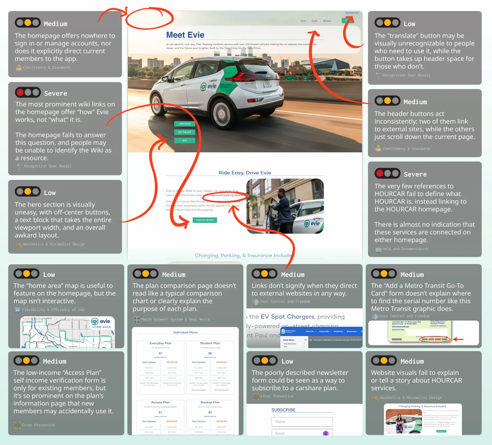

### Comments On Support Wiki
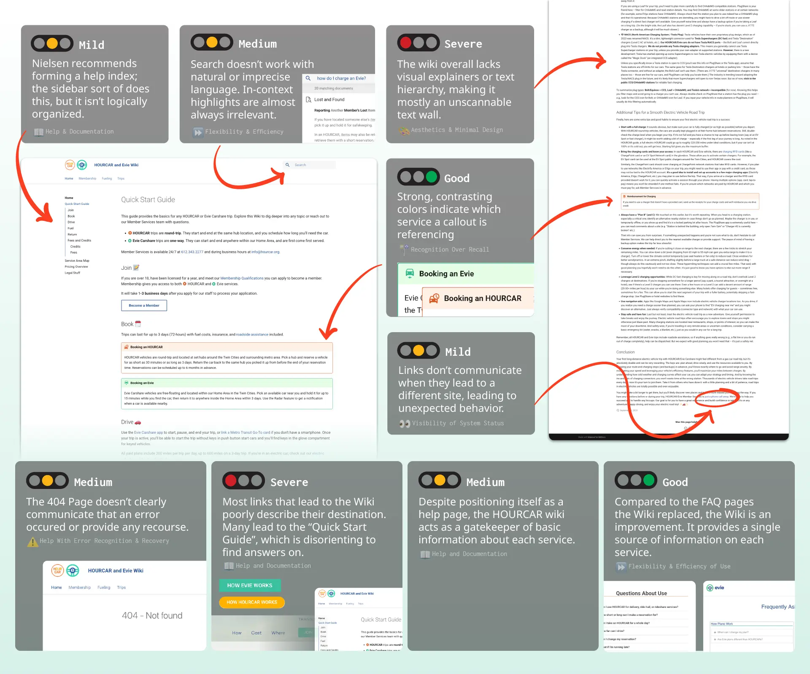

## Usability Test Structure
We used the results of our heuristic evaluation and HOURCAR's research goals to structure our usability test. We recruited five participants, who joined virtually.

### Scenarios and Tasks
To test how our participants used the website, we came up with four realistic scenarios with tasks to perform.

    

        

            <h3>Scenario 1</h3>
            
This scenario asked participants to <strong>research HOURCAR services</strong>, find the <strong>best membership plan</strong> for a given demographic, and figure out <strong>how to register.</strong>

        

    

    

        

            <h3>Scenario 2</h3>
            
This scenario acted as a knowledge check; it asked participants to <strong>choose the best service</strong> to use for a given scenario.

        

    

    

        

            <h3>Scenario 3</h3>
            
This scenario asked participants how to pay for third-party EV charging. This tested how they <strong>searched the wiki</strong> for specific, less prominent information.

        

    

    

        

            <h3>Scenario 4</h3>
            
This scenario pushed participants to <strong>quickly search</strong> for insurance information, as if they were in a crash. This information is easier to find, so we pressured them to act quickly.

        

    

### More Test Information

    

        

            <h3>Participant Demographics</h3>
            
Before the evalutation, we asked participants to describe their transportation habits. None of them had used a carshare service before, and all but one commuted under 3 times a week.

        

    

    

        
        

            <h3>Post-Task Ratings</h3>
            
Each task was followed up with a 5-star rating on the experience and a quick interview.

        

    

    

        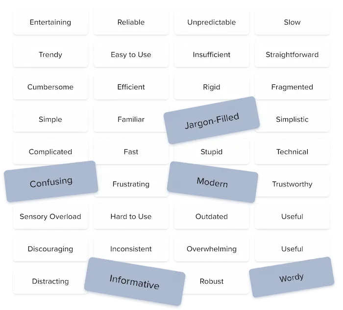
        

            <h3>Product Reaction Cards</h3>
            
Each participant selected five product reaction cards during our debriefing interview to describe their experience.

        

    

## Usability Test Results
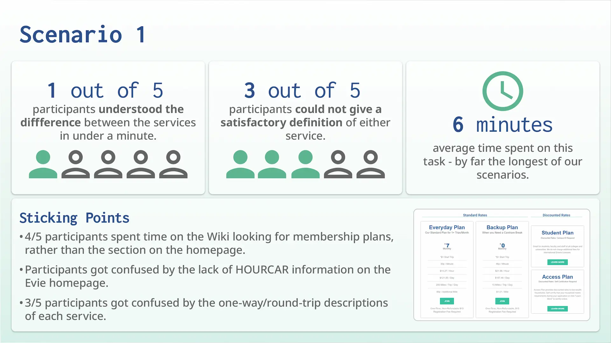
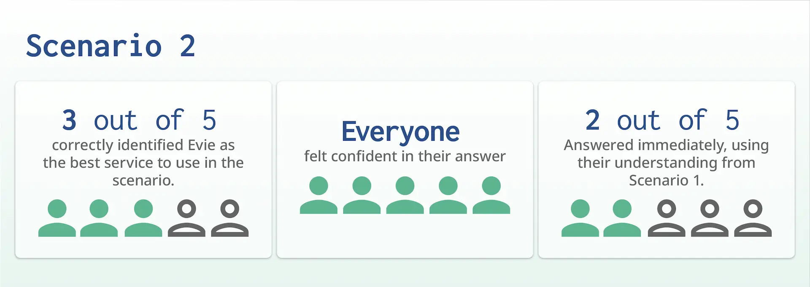
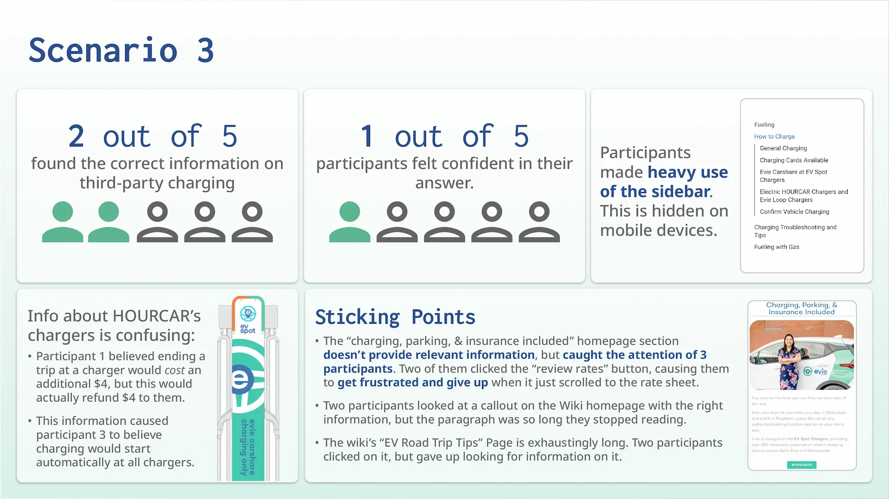
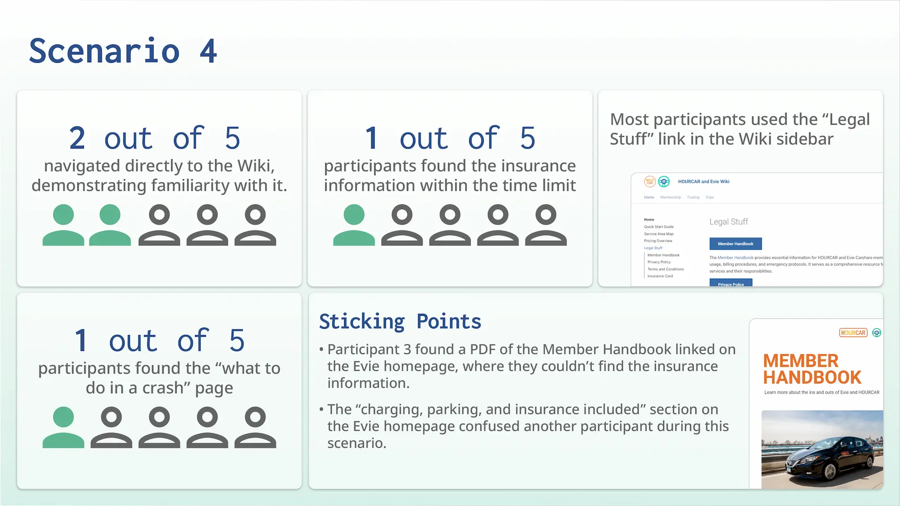
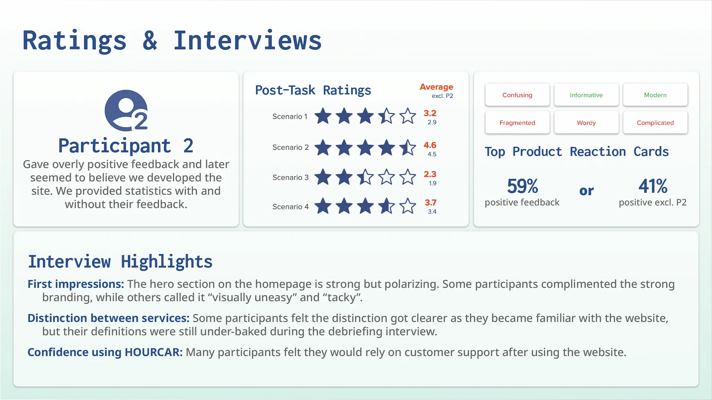

## Recommendations given to HOURCAR

1. **Organize site content more intentionally and implement clearer and more deliberate phrasing.** Our participants had never used HOURCAR services before, and their understanding was based on a short description on the support Wiki's homepage. Basic understanding of HOURCAR's core services shouldn't be based on a help article. We specifically recommended using a pair of identifying phrases like "round-trip" and "one-way" to identify the services and using that across every website.
2. **Make a graphic comparison table to clearly differentiate services on the homepage.** The lack of comparison between Evie, HOURCAR, and other competing services like Lime threw off our participants. We recommended prominently featuring this comparison on each homepage (not just the Wiki).
3. **Be upfront and consistent about where links lead.** Several times, our participants were thrown off track because a link unexpectedly scrolled the page or brought them to an external site. We recommended visually differentiating links based on where they led and making sure they describe their destination well.
4. **Create a categorical index of the Wiki.** Our participants relied heavily on the Wiki's sidebar and navigation bar, not search. This isn't super surprising, as unfamiliar users tend to prefer visually scanning for the information they need instead of guessing which keywords to search. Like an index of a book, we recommended having similar articles listed together for easier recognition.
5. **Make the search function more useful, prominent, and accessible.** None of our participants used the wiki's search box, meaning they didn't identify it as a resource. Search acts as an "escape hatch when users are stuck in navigation" (Nielsen) and is therefore an important for support sites like the Wiki. Our heuristic evaluation showed that the search bar isn't very useful, while our usability test showed it may not be identifiable to users. We recommended featuring a prominent search function on every page, allowing natural language searches, and tagging content better. We also recommended focusing on other areas *first* because search is difficult to implement well and often used as a crutch.

## Example Mockup
To demonstrate what our recommendations could look like in practice, I made a simple <a class="exlink" target="_blank" rel="noopener noreferrer" href="//www.figma.com/proto/1KMYcF2NOd9L4jpirDXRDw/Untitled?node-id=0-1&p=f&t=3GRVXTduNygH0gS6-0&scaling=scale-down&content-scaling=fixed&starting-point-node-id=5%3A2">mockup in Figma</a> to share with HOURCAR.
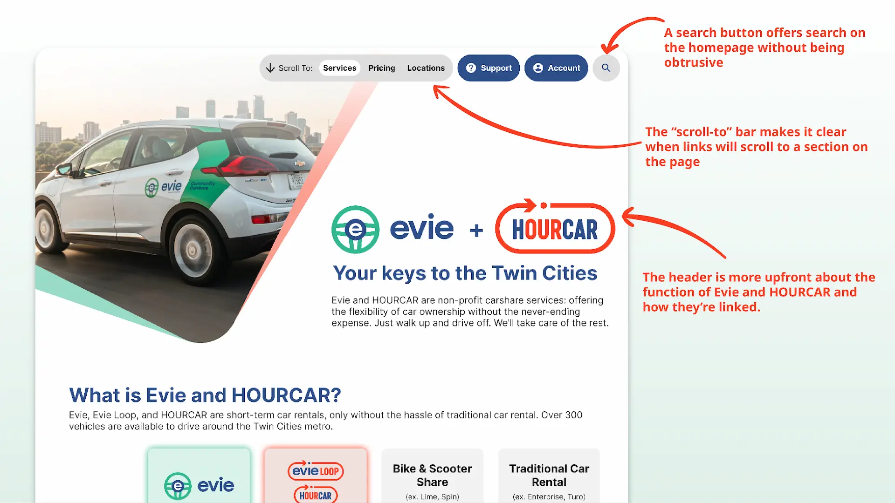
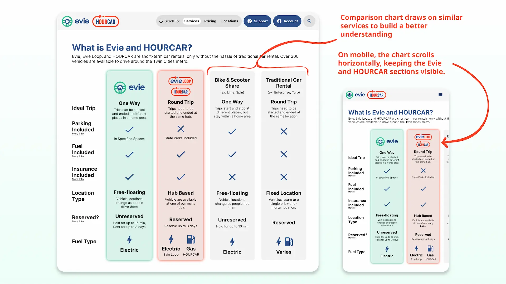
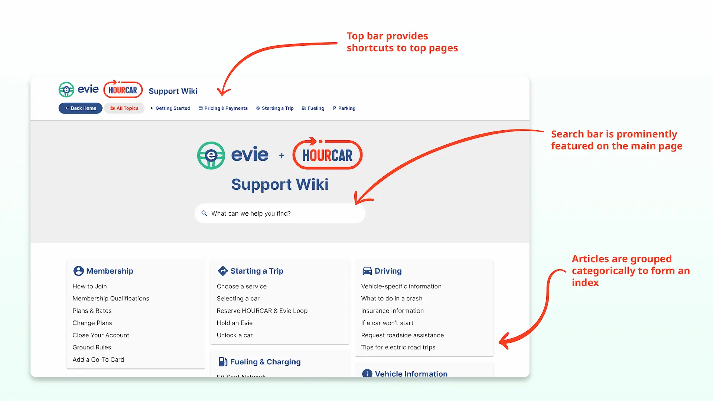