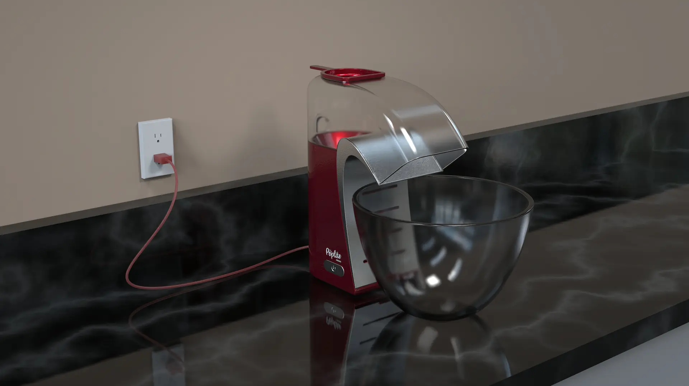
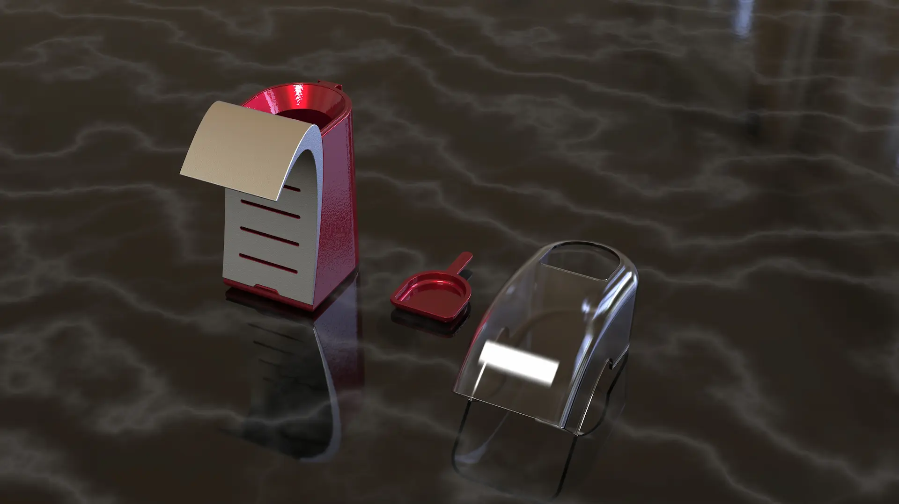
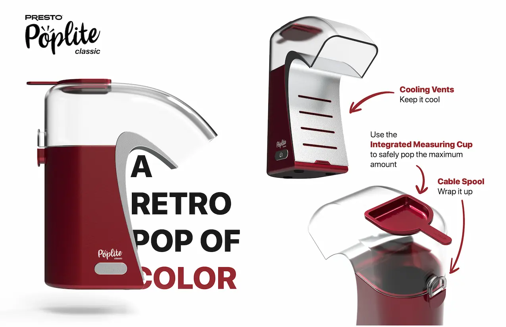

## Project Goals
* Design and model a air-pop popcorn machine in SolidWorks
* Render the appliance using KeyShot

### Design Intent
* Inspired by the bright colors and metallic accents found in 1950s appliances
* Draws from Preto's existing Poplite line-up and styling

## Result

